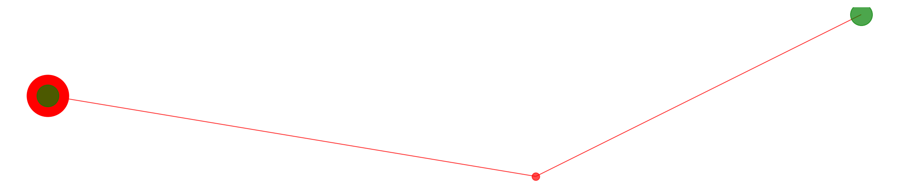
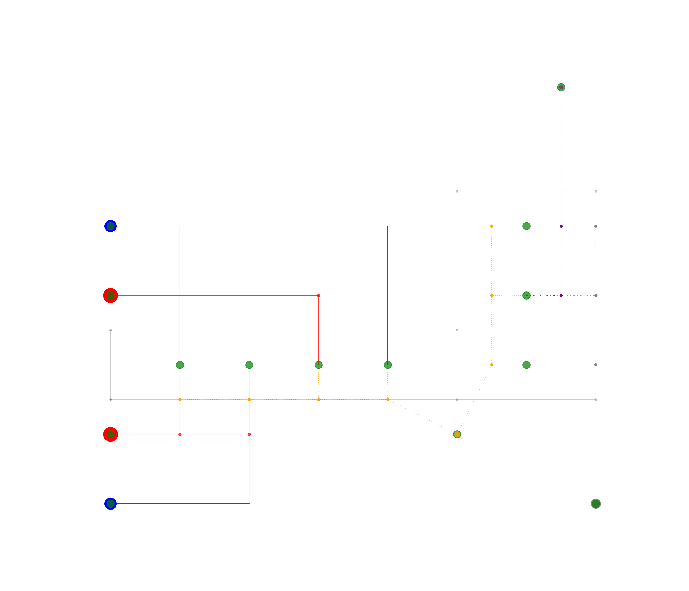
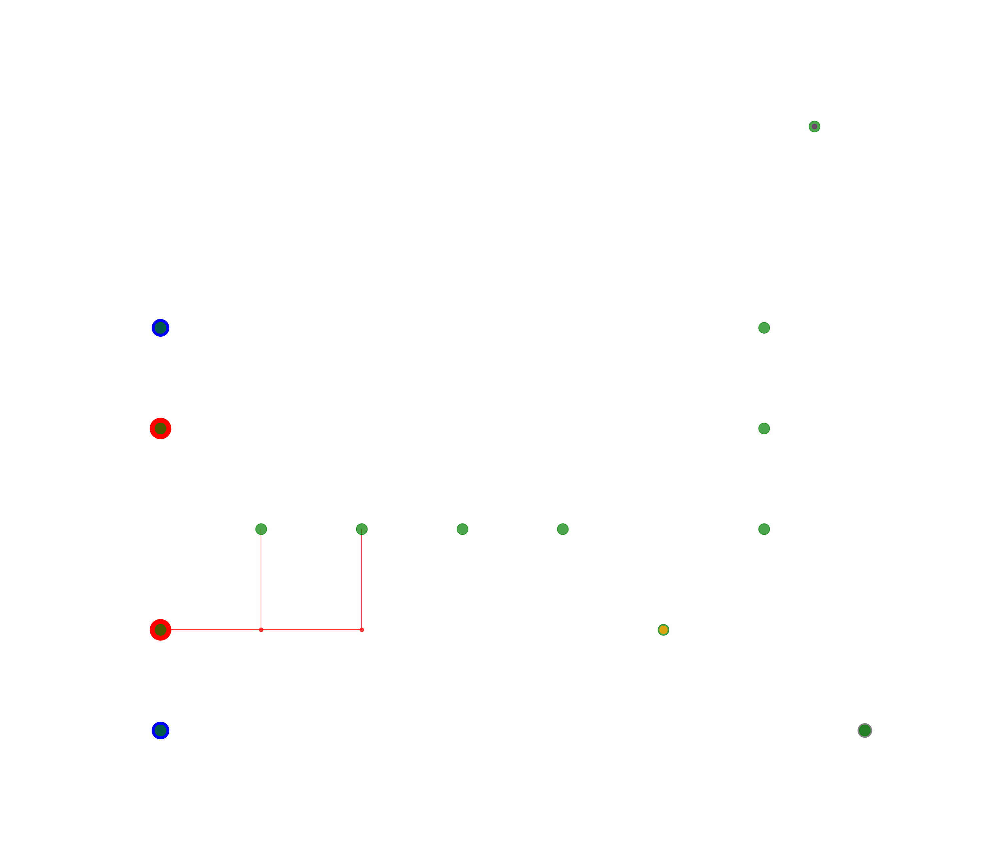

# uesgraphs

[](http://doge.mit-license.org)
[](https://travis-ci.com/RWTH-EBC/uesgraphs)

uesgraphs is a Python package to describe Urban Energy Systems and manage their
data in a Python graph structure. We extend the
[networkx](https://networkx.github.io/) Graph class and add basic methods to
represent buildings and energy networks in the graph. uesgraphs can be used as a
foundation to analyze energy network structures, evaluate district energy
systems or generate simulation models.

uesgraphs is being developed at [RWTH Aachen University, E.ON Energy
Research Center, Institute for Energy Efficient Buildings and Indoor
Climate](https://www.ebc.eonerc.rwth-aachen.de/cms/~dmzz/E-ON-ERC-EBC/?lidx=1).

## Getting started

### Install uesgraphs

uesgraphs relies on other packages to function correctly. On Windows, it may be
necessary to install *shapely* and *pyproj* before uesgraphs.
We recommend to download  the .whl
files for installing [*shapely*](http://www.lfd.uci.edu/~gohlke/pythonlibs/#shapely)
and [*pyproj*](http://www.lfd.uci.edu/~gohlke/pythonlibs/#pyproj) from the
[Unofficial Windows Binaries for Python Extension Packages](http://www.lfd.uci.edu/~gohlke/pythonlibs/)
for your system and python versions. Install both .whl files with
`pip install <path/to/file.whl>`.

One way to get uesgraphs set up is to use a fresh Conda environment by following
these steps:

- Install Miniconda or update your conda installation with `conda update conda`
- Create a new environment with `conda create -n <nameOfEnvironment> python=3.6`
- Activate the environment with `source activate <nameOfEnvironment>` on Linux
or `activate <nameOfEnvironment>` on Windows
- Clone uesgraphs with `git clone https://github.com/RWTH-EBC/uesgraphs.git`
- Install uesgraphs with `pip install -e <path/to/your/uesgraphs>`
- Verify your uesgraphs installation by running the automated tests. Go to your
uesgraphs top-level folder and type `py.test --mpl`

### Usage

You can assemble a graph of an urban energy system by adding buildings, network
nodes and edges to an `UESGraph` object. The following code builds a heating
network from one building to another, connected via one network node:

```Python
import uesgraphs as ug
from shapely.geometry import Point

graph = ug.UESGraph()

supply = graph.add_building(
    name='Supply',
    position=Point(0, 10),
    is_supply_heating=True,
)
demand = graph.add_building(
    name='Building 1',
    position=Point(50, 15),
)
heating_node = graph.add_network_node(
    network_type='heating',
    position=Point(30, 5),
)

graph.add_edge(supply, heating_node)
graph.add_edge(heating_node, demand)
```

You can go on to plot this energy system with

```Python
vis = ug.Visuals(graph)
vis.show_network(
    show_plot=True,
    scaling_factor=30,
    )
```



Instead of building a graph from scratch, uesgraphs comes with an example
containing all supported energy network types. You can create this example
graph with

```Python
import uesgraphs as ug
from shapely.geometry import Point

graph = ug.simple_dhc_model()
graph = ug.add_more_networks(graph)

vis = ug.Visuals(example_district)
fig = vis.show_network(
    show_plot=True,
    scaling_factor=10,
)
```

This leads to the following plot:



You can extract single networks into their own subgraph with

```Python
heating_network_1 = graph.create_subgraphs('heating')['default']
```

In the example above, this extracts the first of the two heating networks shown
in red:



You can use this graph framework to add data to the nodes and edges, e.g.

```Python
import uesgraphs as ug
from shapely.geometry import Point

graph = ug.UESGraph()

demand = graph.add_building(
    name='Building 1',
    position=Point(50, 15),
)

graph.nodes[demand]['heat_load_kW'] = 200
```

This can be used as a foundation to analyze networks or to generate models.

## License

uesgraphs is released by RWTH Aachen University, E.ON Energy
Research Center, Institute for Energy Efficient Buildings and Indoor Climate,
under the
[MIT License](https://github.com/RWTH-EBC/uesgraphs/blob/master/LICENSE.md).

## Reference

To reference uesgraphs, please cite the following paper (doi
[10.1016/j.energy.2016.04.023](https://doi.org/10.1016/j.energy.2016.04.023)):


>Marcus Fuchs, Jens Teichmann, Moritz Lauster, Peter Remmen, Rita Streblow,
Dirk Müller: Workflow automation for combined modeling of buildings and district
energy systems, Energy, Volume 117, Part 2, 2016, Pages 478-484.

The BibTex for this paper is:

```BibTex
@article{Fuchs2016,
  doi = {10.1016/j.energy.2016.04.023},
  url = {https://doi.org/10.1016/j.energy.2016.04.023},
  year  = {2016},
  month = {dec},
  publisher = {Elsevier {BV}},
  volume = {117},
  pages = {478--484},
  author = {Marcus Fuchs and Jens Teichmann and Moritz Lauster and Peter Remmen and Rita Streblow and Dirk M\"{u}ller},
  title = {Workflow automation for combined modeling of buildings and district energy systems},
  journal = {Energy}
}
```
