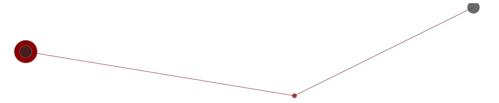
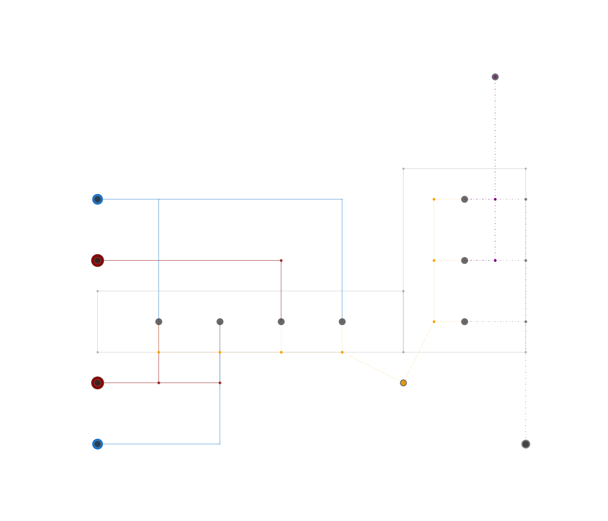
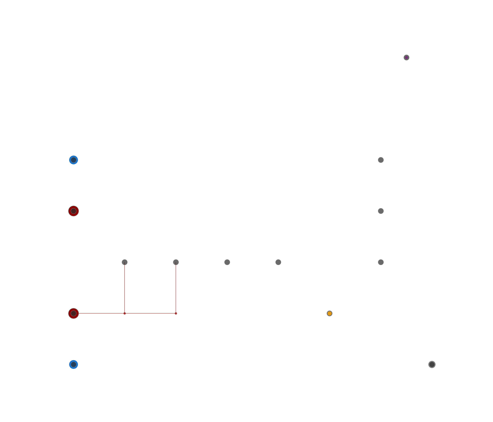

# uesgraphs

[](http://doge.mit-license.org)
[](https://rwth-ebc.github.io//uesgraphs/master/docs/)
[](https://github.com/RWTH-EBC/uesgraphs/actions/workflows/ci.yml)


**uesgraphs** is a Python package for describing Urban Energy Systems, managing their data within a Python graph structure, and enabling the automatic generation of dynamic district simulation models. We extend the
[networkx](https://networkx.github.io/) Graph class and add basic methods to
represent buildings and energy networks in the graph. **uesgraphs** can be used as a
foundation to analyze energy network structures, evaluate district energy
systems or generate simulation models. **Version 2** has been updated with the following enhancements:
- **Simplified Installation**: Easier installation with the removal of unnecessary Python library dependencies.
- **Enabled Logging Features**: Logging functionality has been activated for better tracking and debugging.
- **Enhanced Compatibility**: Compatible with the latest versions of Modelica and the AixLib package.
- **Improved Visualization**: Enhanced visualization features for better representation of results.
- **Addition of `analyze.py`**: Introduced `analyze.py` to enable simulation post-processing and visualization for dynamic district simulations.
- **Updated Model Template Generation**: The template generation feature for Modelica models has been updated, enabling automation of multiple models.
- **Updated Examples**: The examples for **uesgraphs** have been updated, and two new examples have been added to clarify the use of template generation and the `analyze.py` script.

**uesgraphs** is being developed at [RWTH Aachen University, E.ON Energy
Research Center, Institute for Energy Efficient Buildings and Indoor
Climate](https://www.ebc.eonerc.rwth-aachen.de/cms/~dmzz/E-ON-ERC-EBC/?lidx=1).

If you have any questions regarding the tool, feel free to contact us at [ebc-tools@eonerc.rwth-aachen.de](mailto:ebc-tools@eonerc.rwth-aachen.de).

## :rocket: Quick start

### :wrench: Install uesgraphs

We recommend using **Conda** or **Anaconda** for installing **uesgraphs**. Usage of `python venv` has shown to cause trouble in the installation process.

Follow these steps to install **uesgraphs** using Conda:

1. **Create a new virtual environment**:

   ```bash
   conda create -n uesgraphs python=3.13
   ```

   > **Note**: Replace `3.13` with your desired version of Python.

2. **Activate the virtual environment**:

   ```bash
   conda activate uesgraphs
   ```

3. **Clone or download the uesgraphs repository**.

   - If you're cloning the repository using Git, run:

     ```bash
     git clone https://github.com/RWTH-EBC/uesgraphs.git
     ```

   - If you've downloaded the repository as a ZIP file, extract it to your desired location.

4. **Install uesgraphs in editable mode**:

   Navigate to the directory where _uesgraphs_ is located and run:

   ```bash
   pip install -e <path/to/your/uesgraphs>
   ```

5. **Verify your uesgraphs installation** by running the automated tests:

   Navigate to the top-level _uesgraphs_ folder and execute:

   ```bash
   pytest --mpl
   ```

   This will run the test suite and verify that everything is set up correctly.

For more detailed information, please check the `pyproject.toml` file.

6. **Install OpenModelica and OMPython to Run Examples 9 to 14**

   To run examples 9 to 14, you need to install **OpenModelica** and **OMPython**.

   - **Download and Install OpenModelica**:

     - Visit the [OpenModelica download page](https://openmodelica.org/download/download-windows/) to download the installer for your operating system.
     - Follow the on-screen instructions to install OpenModelica on your computer.
     - Add OpenModelica to the environment variable

   - **Install OMPython**:

     - **OMPython** is a Python interface for OpenModelica.
     - Install OMPython using `pip`:

       ```bash
       pip install "OMPython>=3.4.0,<4.0.0"
       ```

       Or install with the optional templates dependency:

       ```bash
       pip install -e ".[templates]"
       ```

     - **Note**: uesgraphs is currently compatible with OMPython versions 3.x only. Version 4.0.0+ introduces breaking API changes that are not yet supported.

     - **Tested Configurations**:
       - ✓ OpenModelica 1.24.4 + OMPython 3.6.0
       - ✓ OpenModelica 1.26.0 + OMPython 3.6.0

     - For more information on OMPython, refer to the [OMPython documentation](https://openmodelica.org/doc/OpenModelicaUsersGuide/latest/ompython.html#ompython).


### :bulb: Usage

You can assemble a graph of an urban energy system by adding buildings, network
nodes and edges to an `UESGraph` object. The following code builds a heating
network from one building to another, connected via one network node:

```Python
import uesgraphs as ug
from shapely.geometry import Point

graph = ug.UESGraph()

supply = graph.add_building(
    name='Supply',
    position=Point(0, 10),
    is_supply_heating=True,
)
demand = graph.add_building(
    name='Building 1',
    position=Point(50, 15),
)
heating_node = graph.add_network_node(
    network_type='heating',
    position=Point(30, 5),
)

graph.add_edge(supply, heating_node)
graph.add_edge(heating_node, demand)
```

You can go on to plot this energy system with

```Python
vis = ug.Visuals(graph)
vis.show_network(
    show_plot=True,
    scaling_factor=30,
    )
```



Instead of building a graph from scratch, uesgraphs comes with an example
containing all supported energy network types. You can create this example
graph with

```Python
import uesgraphs as ug
from shapely.geometry import Point

graph = ug.simple_dhc_model()
graph = ug.add_more_networks(graph)

vis = ug.Visuals(example_district)
fig = vis.show_network(
    show_plot=True,
    scaling_factor=10,
)
```

This leads to the following plot:



You can extract single networks into their own subgraph with

```Python
heating_network_1 = graph.create_subgraphs('heating')['default']
```

In the example above, this extracts the first of the two heating networks shown
in red:



You can use this graph framework to add data to the nodes and edges, e.g.

```Python
import uesgraphs as ug
from shapely.geometry import Point

graph = ug.UESGraph()

demand = graph.add_building(
    name='Building 1',
    position=Point(50, 15),
)

graph.nodes[demand]['heat_load_kW'] = 200
```

This can be used as a foundation to analyze networks or to generate models.

## Version Information

The package version can be accessed programmatically:

```python
import uesgraphs
print(f"uesgraphs version: {uesgraphs.__version__}")
```

## :herb: Branch strategy

Main branch: `master`

## :memo: Documentation

Further documentation is available in the `/doc` directory. There you find:

- Manual that gives a gist
- Development guidelines

## :page_facing_up: License

**uesgraphs** is released by RWTH Aachen University, E.ON Energy
Research Center, Institute for Energy Efficient Buildings and Indoor Climate,
under the
[MIT License](https://github.com/RWTH-EBC/uesgraphs/blob/master/LICENSE.md).

## :books: How to cite uesgraphs

To reference **uesgraphs**, please cite the following papers: 
+ (doi [10.1016/j.energy.2016.04.023](https://doi.org/10.1016/j.energy.2016.04.023)):

> M. Fuchs, J. Teichmann, M. Lauster, P. Remmen, R. Streblow, and D. Müller, “Workflow automation for combined modeling of buildings and district energy systems,” Energy, vol. 117, pp. 478–484, Dec. 2016.

The BibTex for this paper is:

```BibTex
@article{Fuchs2016,
  doi = {10.1016/j.energy.2016.04.023},
  url = {https://doi.org/10.1016/j.energy.2016.04.023},
  year  = {2016},
  month = {dec},
  publisher = {Elsevier {BV}},
  volume = {117},
  pages = {478--484},
  author = {Marcus Fuchs and Jens Teichmann and Moritz Lauster and Peter Remmen and Rita Streblow and Dirk M\"{u}ller},
  title = {Workflow automation for combined modeling of buildings and district energy systems},
  journal = {Energy}
}
```
### Related Publications
+ (doi [10.3390/en151243723](https://doi.org/10.3390/en15124372)):

> M. Mans, T. Blacha, T. Schreiber, and D. Müller, “Development and Application of an Open-Source Framework for Automated Thermal Network Generation and Simulations in Modelica,” Energies, vol. 15, no. 12, p. 4372, Jun. 2022.

The BibTex for this paper is:

```BibTex
@article{Mans2022,
  doi = {10.3390/en15124372},
  url = {https://doi.org/10.3390/en15124372},
  year  = {2022},
  month = {jun},
  publisher = {Energies},
  volume = {15},
  pages = {4372},
  author = {Michael Mans and Tobias Blacha and Thomas Schreiber and Dirk M\"{u}ller},
  title = {Development and Application of an Open-Source Framework for Automated Thermal Network Generation and Simulations in Modelica},
  journal = {Energies}
}
```

## :clap: Acknowledgements

This  work  was  supported  by  the  Helmholtz  Association  under  the  Joint  Initiative  “Energy System 2050 – A Contribution of the Research Field Energy”.

Parts of uesgraphs have been developed within public funded projects
and with financial support by BMWK (German Federal Ministry for Economic Affairs and Climate Action).


