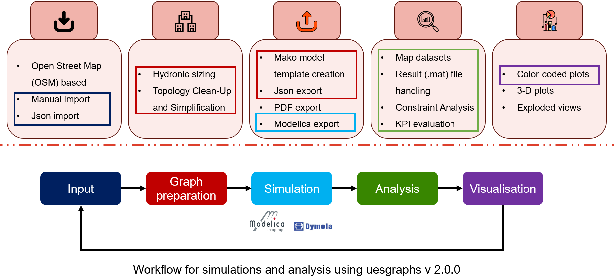

.. image:: _static/EBC_Logo.png
   :alt: EBC Logo
   :align: right

.. image:: _static/Logo_uesgraphs_1.png
   :alt: UESGraphs Logo

|uesgraphs|: Automated graph-based simulation model generation and analysis tool
=================================================================================

.. |uesgraphs| replace:: **uesgraphs**

.. badges-start
.. image:: https://img.shields.io/pypi/v/uesgraphs.svg
   :target: https://pypi.org/project/uesgraphs/
   :alt: PyPI Version

.. image:: https://github.com/RWTH-EBC/uesgraphs/actions/workflows/test.yml/badge.svg
   :target: https://github.com/RWTH-EBC/uesgraphs/actions/workflows/test.yml
   :alt: CI Tests

.. image:: http://img.shields.io/:license-mit-blue.svg
   :target: https://github.com/RWTH-EBC/uesgraphs/blob/master/LICENSE.txt
   :alt: License: MIT
.. badges-end

**uesgraphs** is a Python package developed at RWTH-EBC. It utilizes a graph structure to manage data for buildings, energy networks, and infrastructure, enabling the **automated generation of dynamic district simulation models**.

### General Motivation
---------------------

The decarbonization of energy supply demands **integral approaches** and **automation** to manage the increasing complexity of urban energy systems. **uesgraphs** addresses this by providing a flexible, model-neutral description of complex energy infrastructure that is ready for simulation workflows.

### Getting Started
-------------------

The best way to start is by installing the package and checking out the :doc:`examples`.

.. code-block:: bash

    # 1. Create and activate a new virtual environment
    conda create -n uesgraphs-env python=3.13
    conda activate uesgraphs-env

    # 2. Install uesgraphs
    pip install uesgraphs

### Structure and Workflow
-------------------------

**uesgraphs** is built with `networkx` as its core library. The typical workflow for the tool involves:

The comprehensive workflow is broken down into these five stages:

1.  **Input**: Data ingestion from various sources, including Open Street Map (OSM) based data, manual imports, and JSON imports. This forms the foundation of the system model.
2.  **Graph preparation**: This stage involves crucial preprocessing steps like hydronic sizing, topology clean-up, and network simplification to ensure a robust and accurate model structure within the :py:class:`uesgraphs.UESGraph`.
3.  **Simulation**: The prepared graph is used to create dynamic simulation model for the district based on the graph generated which can be then simulated in using tools like **Dymola**. This process can also be automated.
4.  **Analysis**: Post-simulation data (such as result `.mat` files) is handled for tasks including constraint analysis and Key Performance Indicator (KPI) evaluation.
5.  **Visualisation**: The final stage focuses on presenting results effectively, offering features like color-coded plots, 3-D plots, and exploded views.

### API Documentation
---------------------

.. toctree::
   :maxdepth: 2
   :caption: Contents:

   code/modules

### Modules
-----------

Core Modules
~~~~~~~~~~~~

.. autosummary::
   :toctree: _autosummary

   uesgraphs.uesgraph
   uesgraphs.visuals
   uesgraphs.analyze
   uesgraphs.template_generation
   uesgraphs.utilities

System Models
~~~~~~~~~~~~~

.. autosummary::
   :toctree: _autosummary

   uesgraphs.systemmodels.systemmodelheating
   uesgraphs.systemmodels.templates
   uesgraphs.systemmodels.utilities

Examples
~~~~~~~~

.. autosummary::
   :toctree: _autosummary

   uesgraphs.examples

Indices and tables
==================

* :ref:`genindex`
* :ref:`modindex`
* :ref:`search`