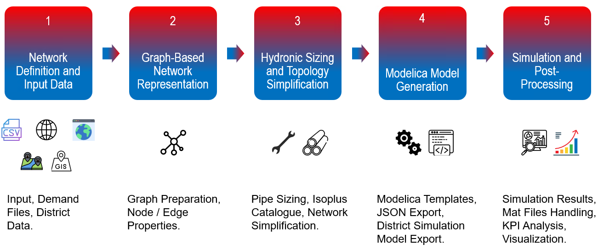

.. image:: _static/EBC_Logo.png
   :alt: EBC Logo
   :align: right

|uesgraphs|: Automated graph-based simulation model generation and analysis tool
=================================================================================

.. |uesgraphs| replace:: **uesgraphs**

.. badges-start

.. image:: https://github.com/RWTH-EBC/uesgraphs/actions/workflows/ci.yml/badge.svg?branch=master
   :target: https://github.com/RWTH-EBC/uesgraphs/actions/workflows/ci.yml
   :alt: CI Tests

.. image:: http://img.shields.io/:license-mit-blue.svg
   :target: http://doge.mit-license.org
   :alt: License: MIT
.. badges-end

**uesgraphs** is an open-source Python framework designed for the automated generation, simulation, and analysis of complex urban energy systems, with a focus on district heating and cooling networks. Built on a graph-based data structure, uesgraphs simplifies the challenging task of modeling interconnected energy infrastructure, enabling researchers and practitioners to rapidly create robust, dynamic simulation models ready for advanced analysis.
The tool seamlessly integrates diverse data sources, including spatial (OpenStreetMap) and tabular datasets, to build high-fidelity system graphs representing buildings, energy networks, and supply stations. Automated workflows encompass hydronic sizing, network topology optimization, and model export to simulation environments like Modelica/Dymola.

Beyond model creation, **uesgraphs** offers comprehensive post-simulation analytics and intuitive visualization capabilities, empowering users to extract actionable insights through color-coded network plots, KPIs, and interactive exploration of complex energy systems.

### Getting Started
-------------------

The best way to start is by installing the package and checking out the :doc:`examples`.

.. code-block:: bash

    # 1. Create and activate a new virtual environment
    conda create -n uesgraphs-env python=3.13
    conda activate uesgraphs-env

    # 2. Install uesgraphs
    pip install uesgraphs

### Functional Principle
-------------------------

**uesgraphs** is built with `networkx` as its core library. The typical workflow for the tool involves:

The functional principle of **uesgraphs** can be summarized as under:

* uesgraphs uses a graph-based structure to represent urban energy systems, where nodes denote buildings, network junctions, and supply units, and edges represent thermal and hydraulic connections like pipes.

* The core graph functionality builds on the Python NetworkX library, allowing flexible and scalable handling of complex system topologies.

* The framework supports automated preprocessing steps such as network cleaning, topology simplification, and hydronic pipe sizing to prepare accurate system models.

* Multiple data input formats are supported, including OpenStreetMap, GIS files, and manual data, enabling integration of heterogeneous spatial and tabular data.

* uesgraphs automates the generation of dynamic simulation models by transforming graph representations into Modelica code through templated model export.

* The tool facilitates downstream analysis and visualization, including color-coded plots and KPI extraction, to support evaluation and decision-making.

API Documentation
=================

.. toctree::
   :maxdepth: 2
   :caption: Contents:

   code/modules
   api_core_modules
   api_system_models
   api_examples

Indices and tables
==================

* :ref:`genindex`
* :ref:`modindex`
* :ref:`search`